<!-- ══════════════════════════════ 3D HERO ══════════════════════════════ -->

<div align="center">

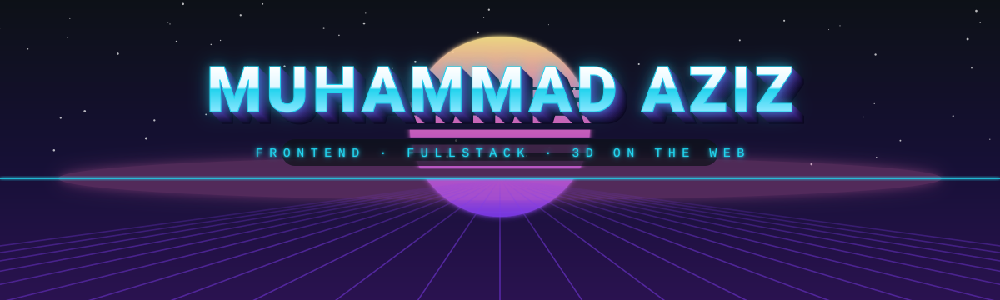


<br/>

<a href="mailto:muhammadaziz62@icloud.com">
  
</a>
<a href="https://t.me/ahmdv0">
  
</a>
<!-- TODO: замени на свой реальный LinkedIn -->
<a href="https://www.linkedin.com/in/your-profile">
  
</a>
<a href="https://github.com/ahmedovs1?tab=followers">
  
</a>



</div>

<!-- ══════════════════════════════ ABOUT ══════════════════════════════ -->

## 🧊 &nbsp;Обо мне

<table border="0">
<tr>
<td width="66%" valign="top">

```ts
const aziz = {
  role:      "Frontend / Fullstack Developer",
  stack:     ["React", "Next.js", "Vue", "Nest.js", "React Native"],
  state:     ["Redux", "Zustand"],
  threeD:    ["Three.js", "React Three Fiber", "GLSL"],
  also:      ["Python"],
  learning:  ["Angular", "C#"],
  motto:     "Сложную идею — в аккуратный и быстрый интерфейс",
} as const;
```

- 🧩 Собираю интерфейсы на **React / Next.js / Vue**
- 🛠 Пишу бэкенд на **Nest.js**, скрипты на **Python**
- 📱 Мобильные приложения на **React Native**
- 🎨 3D, шейдеры и анимации на **Three.js**
- ⚡ Перформанс и плавность — не опция, а требование
- 🧠 Предсказуемый стейт: **Redux**, **Zustand**

</td>
<td width="34%" valign="middle" align="center">


</td>
</tr>
</table>

<div align="center">
</div>

<!-- ══════════════════════════════ STACK ══════════════════════════════ -->

## 🛰️ &nbsp;Стек — на орбите

<div align="center">


<br/>


<br/>



</div>

<!-- ══════════════════════════════ SKILLS ══════════════════════════════ -->

## 📐 &nbsp;Уровень владения — изометрия

<div align="center">



</div>

<!-- ══════════════════════════════ 3D GRAPH ══════════════════════════════ -->

## 🌀 &nbsp;3D-график активности

> Изометрический 3D-рендер моих коммитов — обновляется автоматически каждый день
> через GitHub Action, см. [`.github/workflows/3d-contrib.yml`](.github/workflows/3d-contrib.yml).

<div align="center">

<picture>
  <source media="(prefers-color-scheme: dark)"  srcset="./profile-3d-contrib/profile-night-rainbow.svg" />
  <source media="(prefers-color-scheme: light)" srcset="./profile-3d-contrib/profile-season-animate.svg" />
  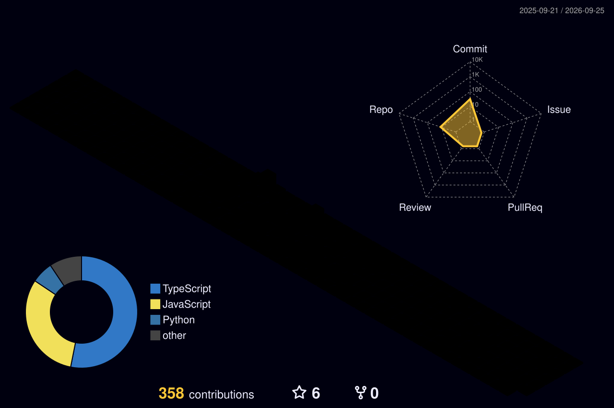
</picture>

<br/>

<details>
<summary><b>🎛 Ещё варианты 3D-рендера</b></summary>
<br/>
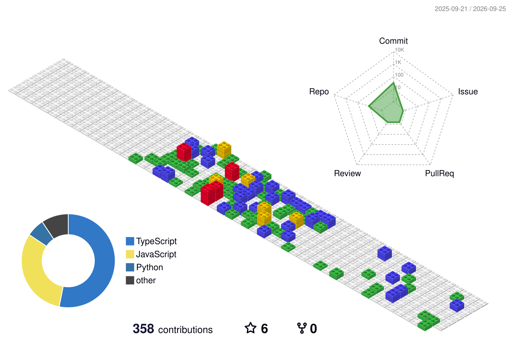
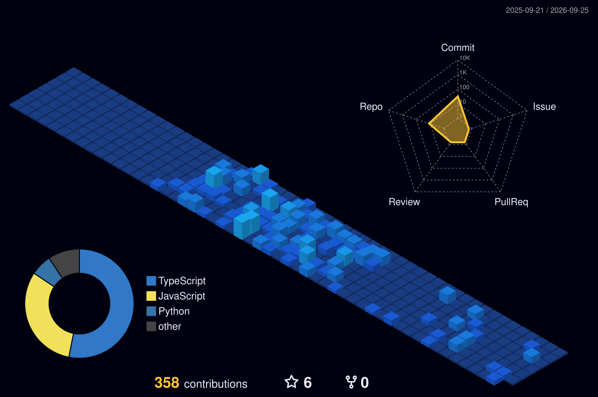
<br/>
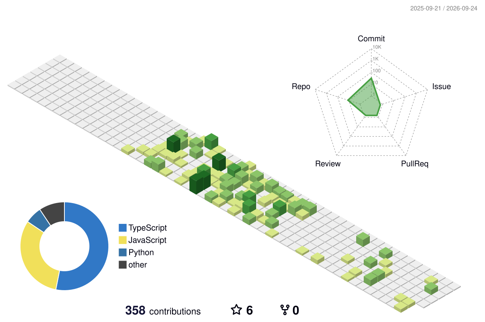
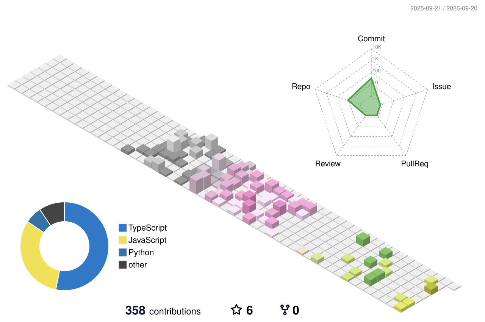
</details>

<br/>

<!-- Змейка съедает контрибуции — генерируется в ветку output -->
<picture>
  <source media="(prefers-color-scheme: dark)"  srcset="https://raw.githubusercontent.com/ahmedovs1/ahmedovs1/output/github-snake-dark.svg" />
  <source media="(prefers-color-scheme: light)" srcset="https://raw.githubusercontent.com/ahmedovs1/ahmedovs1/output/github-snake.svg" />
  
</picture>


</div>

<!-- ══════════════════════════════ STATS ══════════════════════════════ -->

## 📊 &nbsp;GitHub-статистика

<div align="center">


<br/>


<br/><br/>


<br/>


</div>

<!-- ══════════════════════════════ PROJECTS ══════════════════════════════ -->

## 📌 &nbsp;Избранные проекты

<!-- TODO: замени repo=… на реальные названия репозиториев -->
<div align="center">

<a href="https://github.com/ahmedovs1/project-one">
  
</a>
<a href="https://github.com/ahmedovs1/project-two">
  
</a>

<br/><br/>

<a href="https://github.com/ahmedovs1?tab=repositories">
  
</a>

</div>

<!-- ══════════════════════════════ FOOTER ══════════════════════════════ -->

<div align="center">

<br/>


<br/><br/>

**Открыт к интересным задачам — пиши в [Telegram](https://t.me/ahmdv0) или на [почту](mailto:muhammadaziz62@icloud.com).**

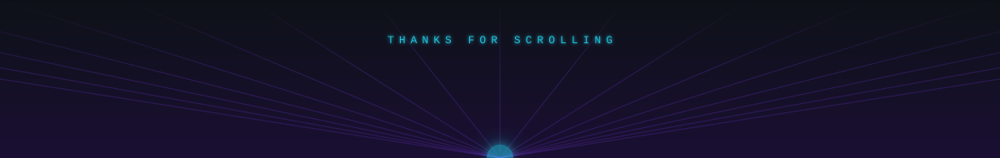

</div>
